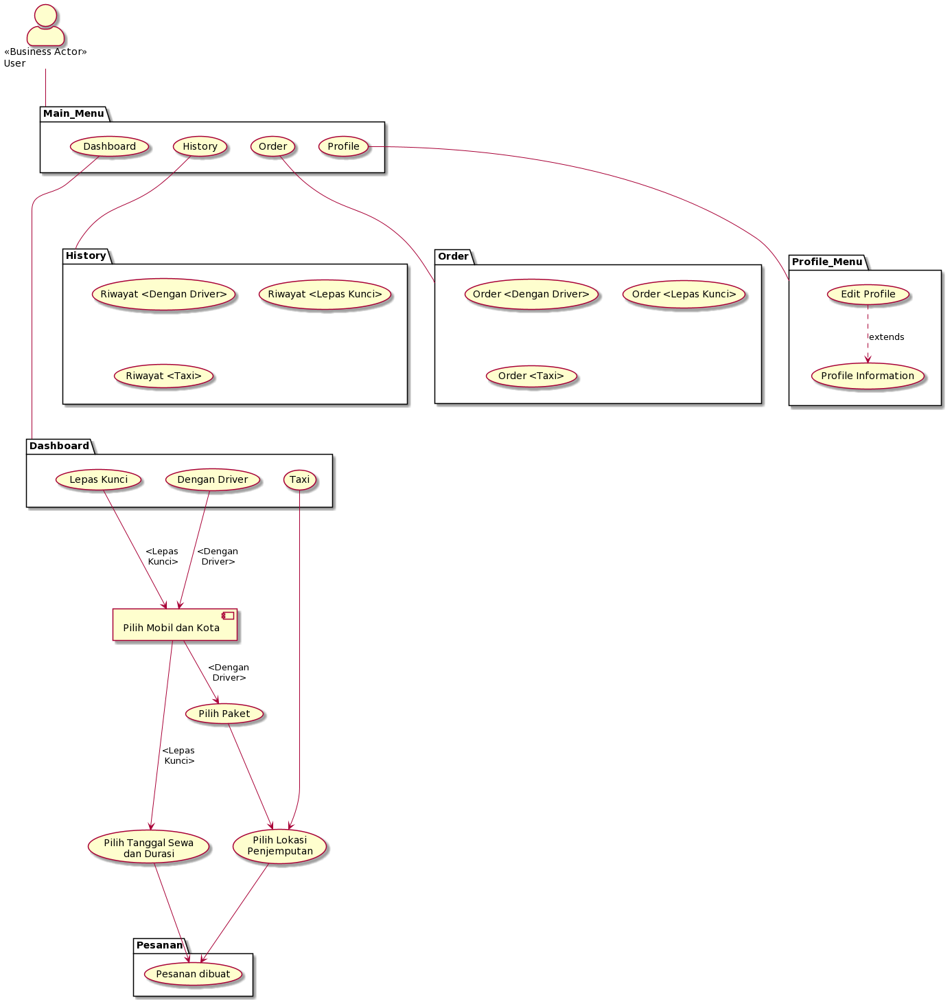
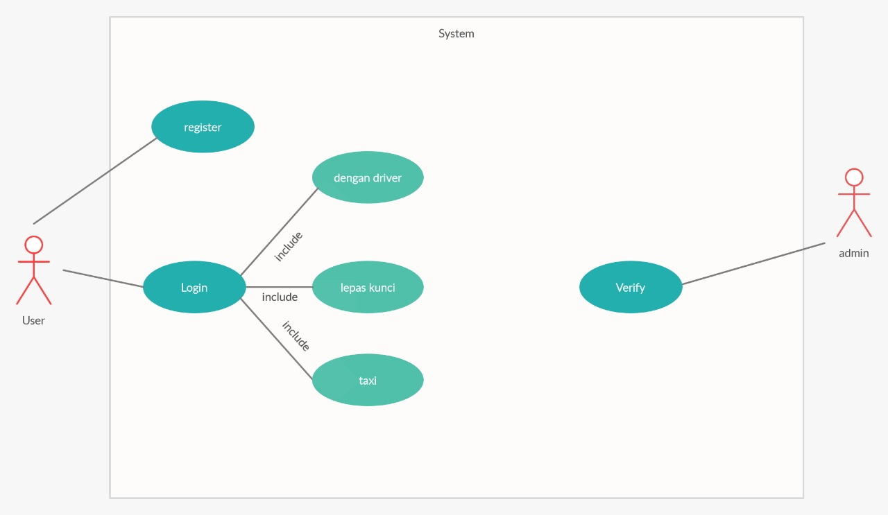
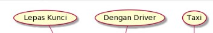

# Assignment 1

## Diagram

## Narration
Liz Transport adalah sebuah aplikasi rental mobil. Didalam aplikasi tersebut, terdapat beberapa menu di Dashboard seperti :
- With Driver -> Untuk menyewa mobil beserta supirnya.
- Rent a Car -> Untuk menyewa mobil tetapi hanya kunci nya saja.
- Taxi -> Untuk menyewa Taxi.

Di Dashboard juga terdapat kupon Promo yang dapat User gunakan dalam orderan dan juga ada Contact Info dari developer jika User memiliki keluhan.

Dalam menggunakan aplikasi tersebut, User diharuskan untuk mendaftar terlebih dahulu dan jika sudah bisa langsung login ke aplikasi.
Untuk penggunaan Menu-nya, masing-masing Menu memiliki kriteria order yang berbeda. Seperti :
- With Driver -> Terdapat beberapa mobil dan paketan yang bisa dipilih.
- Rent a Car -> Terdapat beberapa mobil dan User diminta untuk menginput Tanggal dan Jumlah hari untuk menyewa mobil yang dipilih.
- Taxi -> Terdapat form pengisian untuk menyewa Taxi, disitu terdapat Harga / Penumpang dsb.

Setelah User menggunakan salah satu dari tiga menu tersebut, Admin merespon sehingga User dapat melanjutkan ke tahap selanjutnya.
Setelah menggunakan opsi di Main Menu, info dari orderan dapat terlihat di Reservation. Setelah Pemesanan selesai, maka akan masuk ke menu History.

Di bagian menu Profile, terdapat beberapa data User seperti Nama, Alamat, Nomor, dan Email. Kemudian juga ada opsi untuk mengedit data tersebut.

**Business Process** :
1. User menggunakan beberapa opsi yang ada di Main Menu, 
2. kemudian Orderan tersebut akan masuk ke Reservation, 
3. setelah Orderan selesai, akan masuk ke History,
4. kemudian jika User ingin mengorder lagi, bisa menggunakan Opsi dalam Main Menu lagi.
