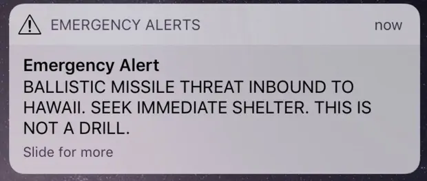
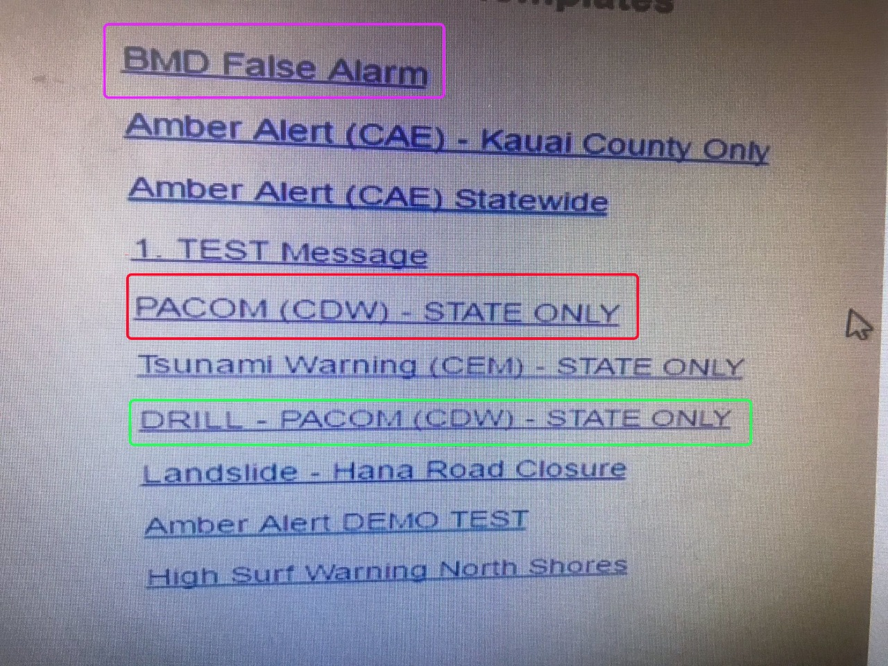
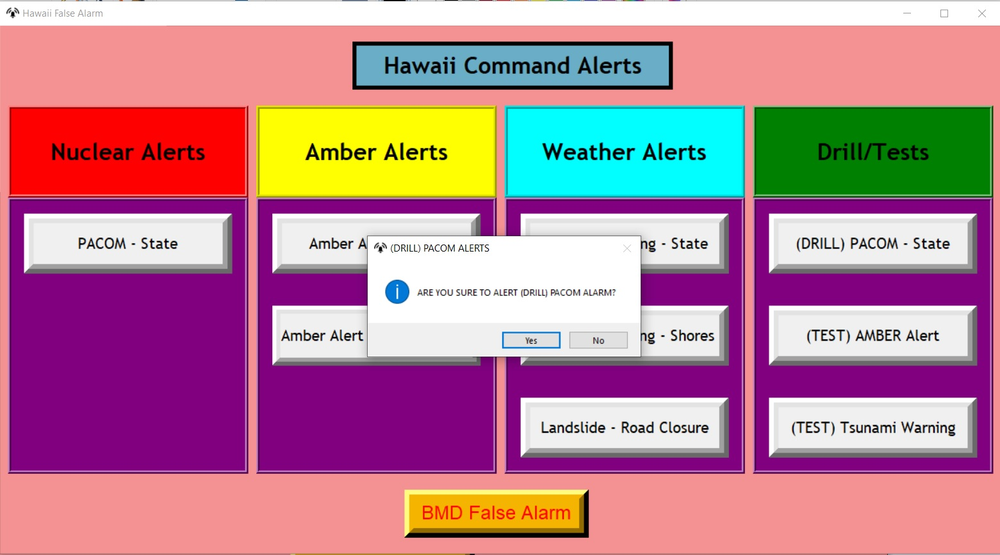
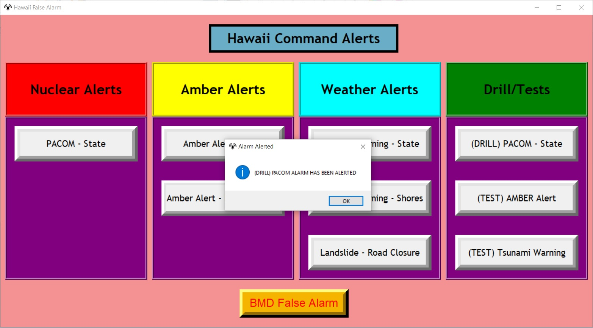
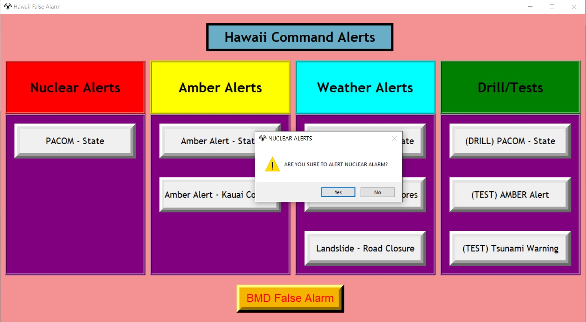
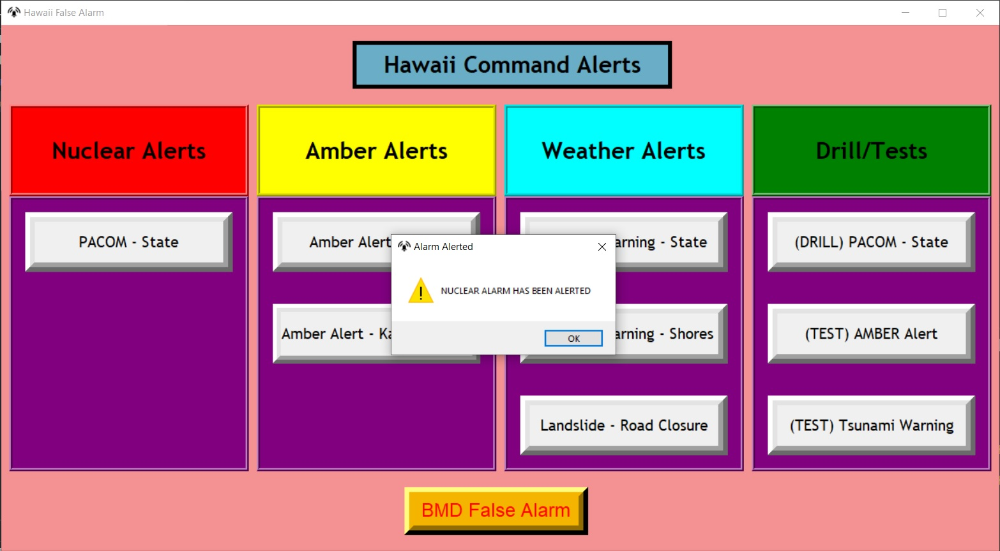
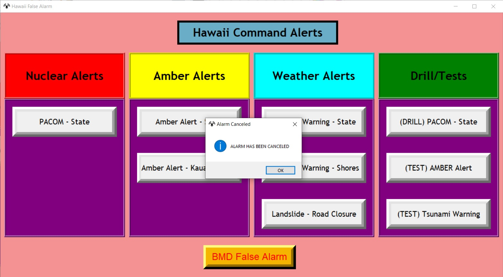

# TASK 1 : Design Analysis

## Abstract

Di tahun 2018, masyarakat Hawaii dikejutkan dengan sebuah pesan dari Hawaiian Emergency Management Agency (HEMA) pada ponsel mereka mengenai peringatan akan datangnya rudal balistik. Situasi Hawaii saat itu berubah menjadi mencekam. Orang-orang berlarian mencari tempat perlindungan, kegiatan yang ada di Hawaii saat itu langsung berhenti. Kekacauan itu terjadi selama 30 menit hingga HEMA memberikan pengumuman kedua. Peringatan rudal balistik itu, ternyata adalah sebuah *test*.

    

Pesan peringatan rudal

## Main Topic
Penyelidikan yang dilakukan pasca kejadian tersebut mengungkap sebuah fakta penting. Salah satu personil yang bekerja di kantor HEMA rupanya melakukan kesalahan dalam mengoperasikan sistem peringatan rudal tersebut. Setelah dimintai keterangan lebih lanjut, ternyata sang personil salah memilih opsi pada sistem. Seharusnya dia memilih menu untuk mengirimkan pesan *testing*, tetapi ia malah memilih peringatan asli.

## Design Error

    

> ***Ket :***\
> *PACOM (CDW) - State Only* [Peringatan rudal asli]\
> *DRILL - PACOM (CDW) - State Only* [Uji peringatan]

Dari kesalahan ini, terdapat detail penting. Opsi untuk melakukan uji sistem dan peringatan asli ternyata berada dalam satu menu yang sama dan terletak berdekatan. Hal ini menurut kami merupaka sebuah kesalahan desain yang tergolong fatal. Apalagi mengingat fakta bahwa kehidupan pasca insiden tersebut membuat beberapa orang kehilangan pekerjaan mereka di Hawaii. 

## Design Analysis

 

Dalam panel Nuclear Alerts, terdapat satu tombol yaitu tombol PACOM State, PACOM adalah singkatan dari Pacific Command. Panel ini adalah panel yang paling penting. Karena tombol yang ada di panel ini pernah disalahgunakan dengan tidak sengaja, jadi tombol ini dijadikan prioritas dengan diberi background warna merah.\

1. Nuclear Alerts -> PACOM State -> Untuk menyalakan alarm nuklir PACOM di negara bagian.

Dalam panel AMBER Alerts, terdapat dua tombol yaitu tombol Amber Alerts State dan Amber Alerts Kauai Country. AMBER adalah singkatan dari America's Missing: Broadcast Emergency Response. Panel ini adalah panel yang penting setelah Nuclear Alerts karena berfungsi untuk  mengumumkan ke publik dalam program membantu mencari anak yang diculik.\

2. Amber Alerts -> Amber Alerts State -> Untuk menyalakan alarm AMBER di negara bagian.

3. Amber Alerts -> Amber Alerts Kauai Country -> Untuk menyalakan alarm AMBER di negara Kauai, tombol ini memiliki fungsi dan jenis yang sama dengan Amber Alerts State namun hanya berbeda lokasi saja.

Dalam panel Weather Alerts, terdapat 3 tombol yang berfungsi untuk mengumumkan peringatan-peringatan cuaca. terdapat peringatan tentang Tsunami Alert, High Surf Warning, Landslide.\

4. Weather Alerts -> Tsunami Warning State --> Untuk menyalakan alarm cuaca tentang peringatan Tsunami di area negara bagian.

5. Weather Alerts -> High Surf Warning Shores --> Untuk menyalakan alarm cuaca tentang peringatan ombak tinggi di area pantai.

6.  Weather Alerts -> Landslide Road Closure --> Untuk menyalakan alarm cuaca tentang peringatan penutupan jalan karena longsor.

Dalam panel Drill / Alerts, terdapat tiga tombol yang berfungsi sama seperti tombol-tombol sebelumnya namun dalam panel ini, semua tombol hanya untuk TESTING, bukan tombol sungguhan. tombol ini digunakan untuk menguji peringatan sebelum penggunaan tombol peringatan yang sebenarnya.\

7. (DRILL) PACOM State -> Untuk menyalakan alarm test nuklir PACOM di negara bagian.

8. (TEST) Amber Alert -> Untuk menyalakan alarm test AMBER.

9.  (TEST) Tsunami Warning -> Untuk menyalakan alarm test peringatan tentang tsunami.

Dan di luar tabel terdapat satu tombol yaitu BMD False Alarm, tombol ini terpisah dari panel karena memiliki fungsi yang berlawanan.\

10. BMD False Alarm -> Untuk membatalkan alarm yang telah dilancarkan.
