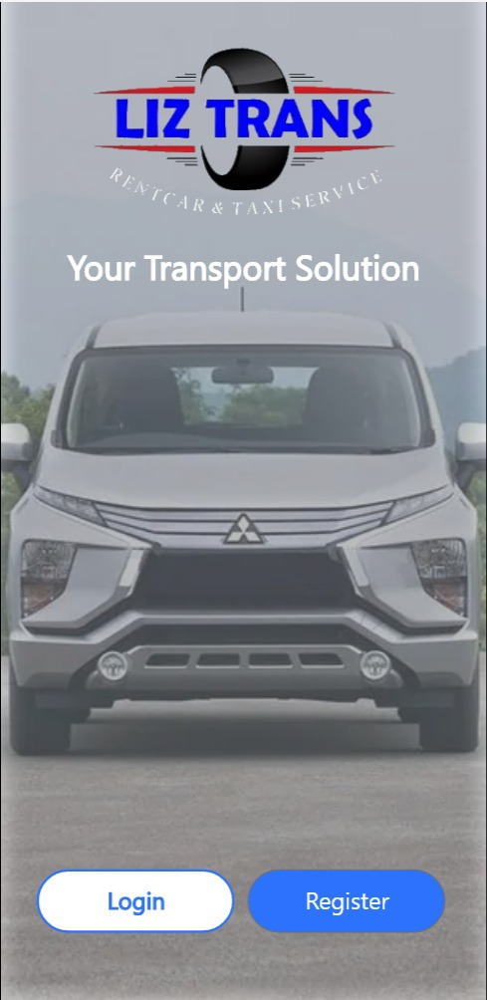
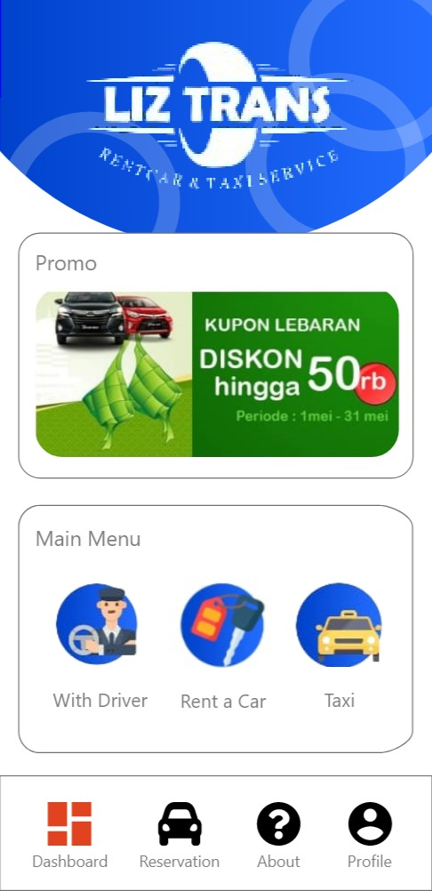
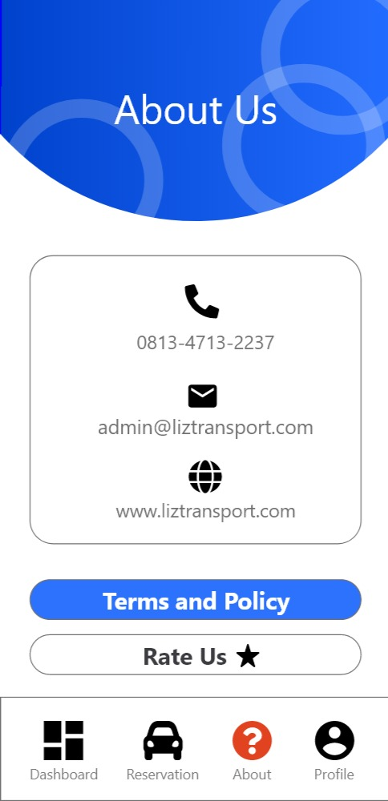
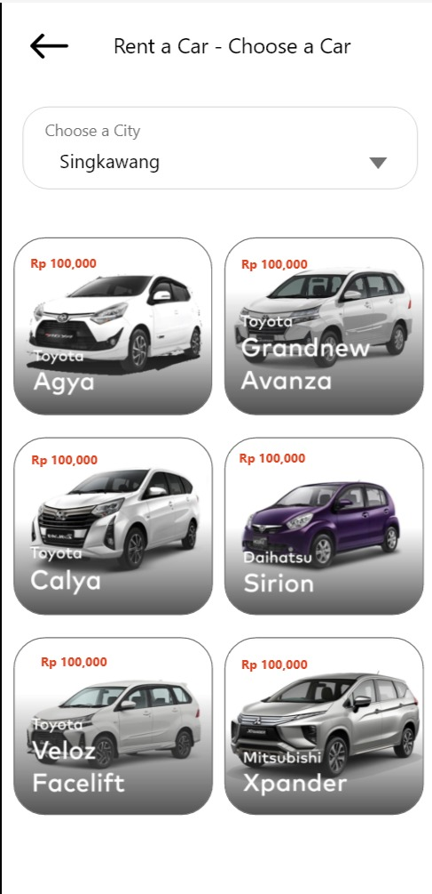
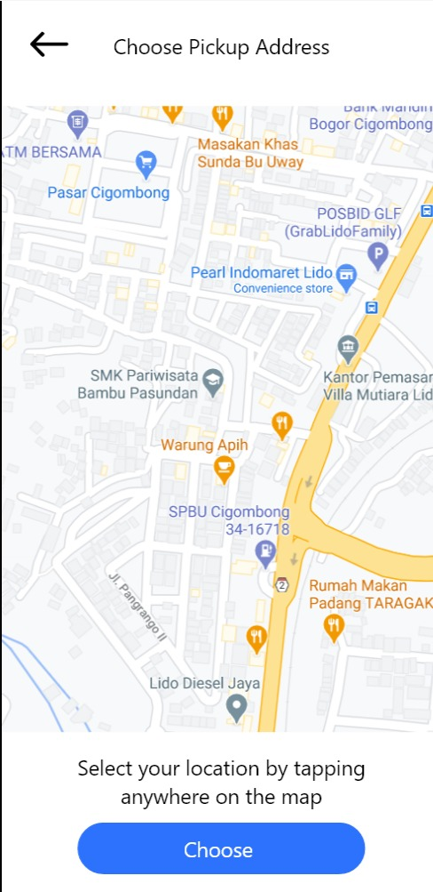
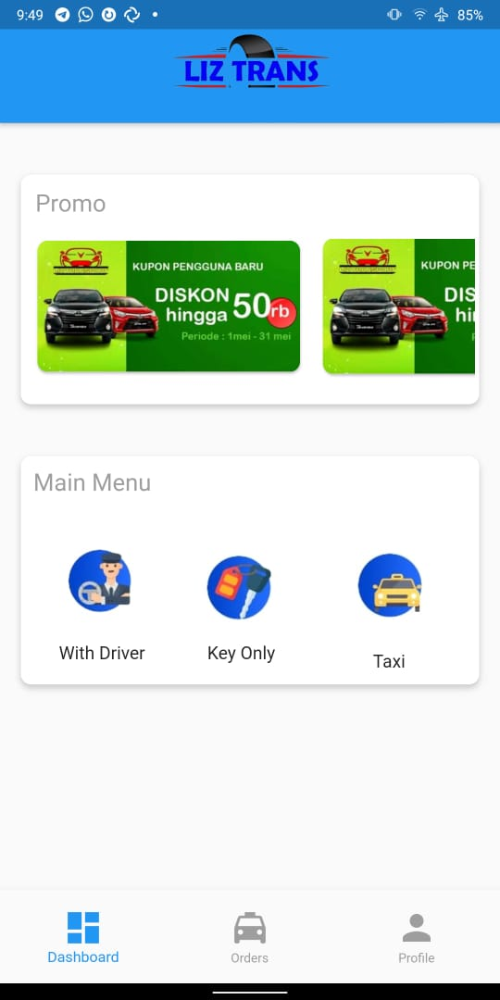
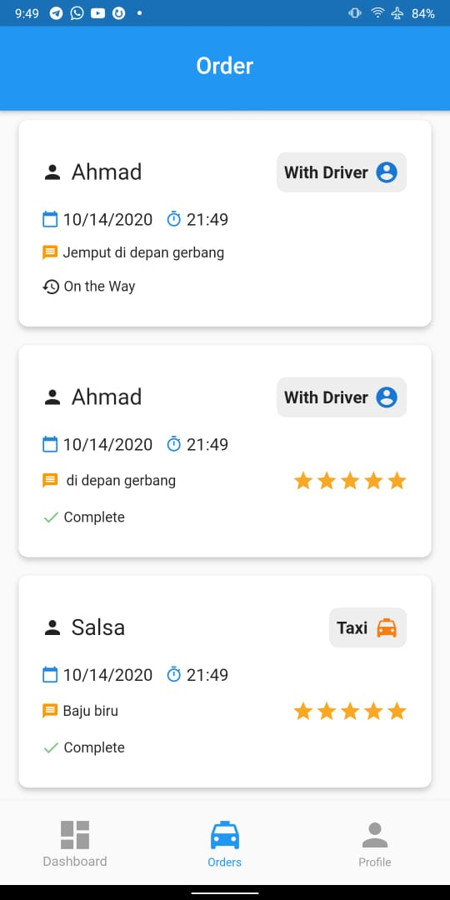
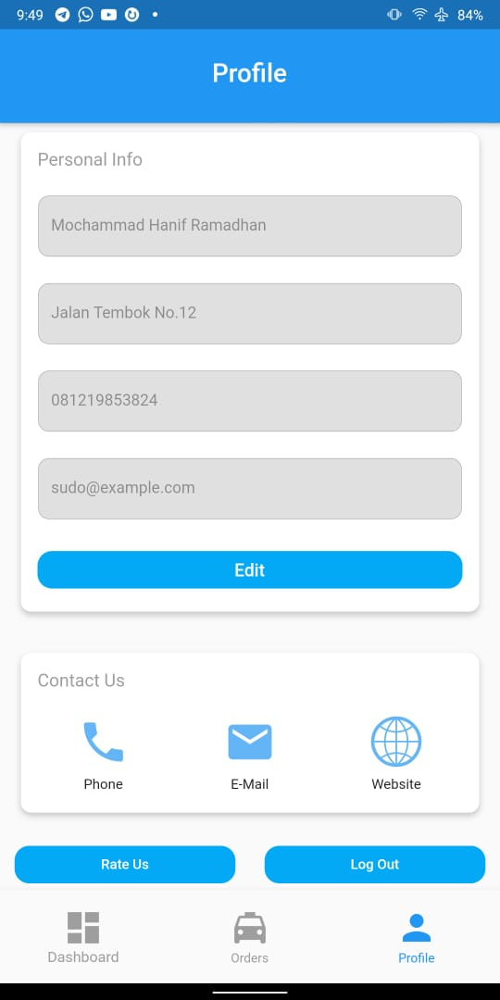

# TASK 2 : Design Sprint

Table of Content
- [x] Day 1 : Discussion About Design Flaw
- [x] Day 2 : Creating A Competing Design
- [x] Day 3 : Voting 
- [x] Day 4 : Giving Feedback to the Developer

## Day 1 : Discussion About Design Flaw
[Video](https://www.youtube.com/playlist?list=PLqvhZMgGxt6JQomRS88j_qoYddwvMh_6m)

### Analisa User Interface (UI)
- Penempatan kontak info dan username pengguna yang menimbulkan kebingungan.
- Untuk tampilan lepas kunci, layout desain sebaiknya menggunakan layout grid untuk mempermudah pengguna dalam memilih.
- Penggunaan map  satellite view yang mempersulit pemilihan lokasi
- Pemilihan lokasi pada peta tidak menampilkan alamat pada kolom alamat
- Penempatan promo yang seharusnya menjadi highlight dalam aplikasi
- Tidak adanya pembatasan yang jelas tentang batasan jumlah penumpang
- Tombol pilih pada peta pemilihan lokasi penjemputan seharusnya bisa di simplifikasi
- Branding pada welcome page dimana mobil tidak sesuai
- Opsi untuk forgot password dalam halaman login
- Pembuatan menu baru khusus untuk bagian "Contact Us" 
- Mobil di list berdasarkan merk atau jenis mobilnya
- Peletakan harga yang disesuaikan dengan list mobil
- Dashboard cukup terfokus pada LIZ TRANS saja, logo logout ditempatkan pada lama profile
- Menu edit diberikan perubahan dimana edit harusnya memiliki menu khusus
- Entri harga dan total harga seharusnya bukan merupakan entri input melainkan menjadi label hasil
- Pada menu pemilihan mobil, daripada menggunakan background bisa diganti dengan preview interior dari mobil tersebut
- Penambahan pesan rating dalam aplikasi ketika telah selesai melakukan transaksi
- Simplifikasi dalam menu History dan Reservation dimana statusnya dapat dipindahkan kedalam card dari entri history

### Analisa User Experience (UX)
- Kurangnya hint interaksi ketika menekan tombol
- Inkonsistensi pada penggunaan bahasa
- Keterangan yang lebih jelas mengenai menu utama yaitu opsi "Dengan Driver" dan "Lepas Kunci"
- Pada menu edit, kontras warna tidak dibedakan ketika kolom aktif saat di edit dan saat sedang tidak aktif
- Menu promo yang seharusnya langsung terhubung dengan menu pemesanan, bukan hanya berupa info
- Interaction flow pada pemesanan. Secara default seharusnya setelah pemilihan tanggal jemput langsung diikuti dengan pemilihan waktu jemput, bukan meminta user untuk melakukan interaksi dengan masing-masing input
- Informasi tentang kontak dari LIZ TRANS bisa digunakan button khusus untuk memudahkan akses langsung pada telpon, email, atau website
- Deskripsi mobil yang lebih informatif, yaitu hanya memuat informasi kunci pada mobil
- Peningkatan pengalaman pengguna dimana ketika memasuki menu pemesanan, maka entri input langsung terisi dengan nama pengguna dan lokasi pengguna saat ini secara otomatis.

## Day 2 : Creating A Competing Design
### Design dari Akbar Maulana Alfatih
Jadi, saya membuat design seperti itu karena menurut saya akan memperbagus aplikasi tersebut. 

Di design saya juga ditambahkan beberapa opsi yang dapat memudahkan user untuk menggunakan aplikasi tersebut. Beberapa opsi yang sudah ada (default dari app-nya) juga saya perbarui agar semakin interaktif.

Beberapa diantaranya adalah :
- Background dirubah agar lebih realistis.
- Menyederhanakan logo Aplikasi supaya lebih nyaman dipandang.
- Merubah beberapa struktur seperti Main Menu dan Promo pada Dashboard.
- Menyederhanakan opsi History sehingga mudah untuk diakses User.
- Membuat opsi About Us untuk memudahkan User menghubungi Developer Aplikasi.
- Menambah Fitur Change Password.
- Mengubah Edit Profile dan Menyederhanakan fungsi Log Out supaya User mudah untuk mengaksesnya.
- Menyederhanakan gambar-gambar mobil supaya User dapat melihat semua mobil yang tersedia.
- Mengubah tampilan Maps supaya terlihat lebih sederhana dan ringan.
- Menambah opsi Rating supaya User dapat menilai aplikasi.
- Membuat detail gambar mobil supaya User dapat melihat rincian dari mobil tersebut.

| | | | | |
|-|-|-|-|-|
||||||

Tools Design : Adobe XD\
[Link Adobe XD](https://xd.adobe.com/view/0e127e7f-867a-4416-a0a9-de21b8ff5dca-5b41/?fullscreen)

### Design dari Mochammad Hanif Ramadhan
Pada desain ini, saya memiliki visi untuk memberikan sentuhan Material Design yang lebih kuat dari aplikasi aslinya. Selain itu, tujuan utama saya adalah untuk meningkatkan *user-experience* bagi pengguna. Beberapa diantaranya adalah :
- Simplifikasi pada menu "History" dan "Order" dengan menggabungkannya menjadi satu menu. Untuk menggantikan fungsionalitas yang hilang maka diberikan status pemesanan beserta kategori dari pesanan yang telah dilakukan. 
- Memberikan sentuhan pada menu profile agar pengguna bisa lebih mengetahui apakah mereka sedang mengedit profil mereka atau tidak. 
- Memberikan tombol khusus pada menu profil untuk mempermudah pengguna apabila ingin mengontak perusahaan.
- Memindahkan tomol Log-Out agar posisi dan fungsionalitas-nya lebih jelas.
- Memberikan bebrapa animasi di tempat tertentu untuk memberi indikasi jika pengguna sedang menyentuh menu tertentu.

| | | |
|-|-|-|
||||

Tools Design : Flutter\
[Link APK](./Design/Hanif/liz_transport.apk)

## Day 3 : Voting 
[Video](https://drive.google.com/file/d/1j1WYxRb3GLonmF-MJyxNkqVNh8_cfUbT/view?usp=sharing)  |  [Subtitle](https://github.com/etrnal70/hci/blob/hw2/Assignment%202/subtitle/Day%203%20-%20Voting.srt)\
**Peserta :** 
- Hary Susilo Pratama
- Abdullah Azzam
- Rudiansyah Pratama

**Hasil :** Desain milik Akbar terpilih sebagai desain yang akan mewakilkan Team A untuk selanjutnya diajukan kepada developer.

## Day 4 : Design Discussion with Developer
Nama : Arrival Dwi Sentosa\
Role : 
- Co-Founder dan CTO di Sgara
- Co-Founder dan IT Advisor di Indonesian Diaspora Connect 

[LinkedIn](https://www.linkedin.com/in/arrivaldwisentosa/?originalSubdomain=id)

[Part I](https://drive.google.com/file/d/1IhgqP7fwzSJBet2LJIZpoHgIhWHMKVuz/view?usp=sharing)  |  [Subtitle](https://github.com/etrnal70/hci/blob/hw2/Assignment%202/subtitle/Day%204%20-%20Part%201.ass)

[Part II](https://drive.google.com/file/d/1EE_DpgE1WRjh1cdvYzhBIVsmFzQHhNbe/view?usp=sharing)  |  [Subtitle](https://github.com/etrnal70/hci/blob/hw2/Assignment%202/subtitle/Day%204%20-%20Part%202.ass)

[Part III](https://drive.google.com/file/d/1uAvNsRFaMCo2HGhPlX12EfCqk0sHUmUW/view?usp=sharing)  |  [Subtitle](https://github.com/etrnal70/hci/blob/hw2/Assignment%202/subtitle/Day%204%20-%20Part%203.ass)

[Part IV](https://drive.google.com/file/d/151dFgnqJsW9OJ_dH2QCGzYFZcWKnVaVS/view?usp=sharing)  |  [Subtitle](https://github.com/etrnal70/hci/blob/hw2/Assignment%202/subtitle/Day%204%20-%20Part%204.srt)

