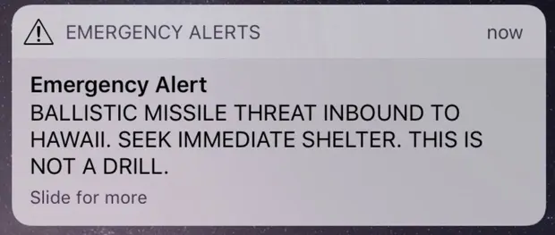

# TASK 1 : Design Analysis

## Abstract

In 2018, people of Hawaii were stunned by a message from the Hawaiian Emergency
Management Agency (HEMA) about ballistic missile alert. People were sent into
panic and run over the place, preparing for each of their own safety. It was a
30 minute of chaos in Hawaii until the HEMA made an announcement. The missile
alert is, in fact, a drill.

    

The missile alert

